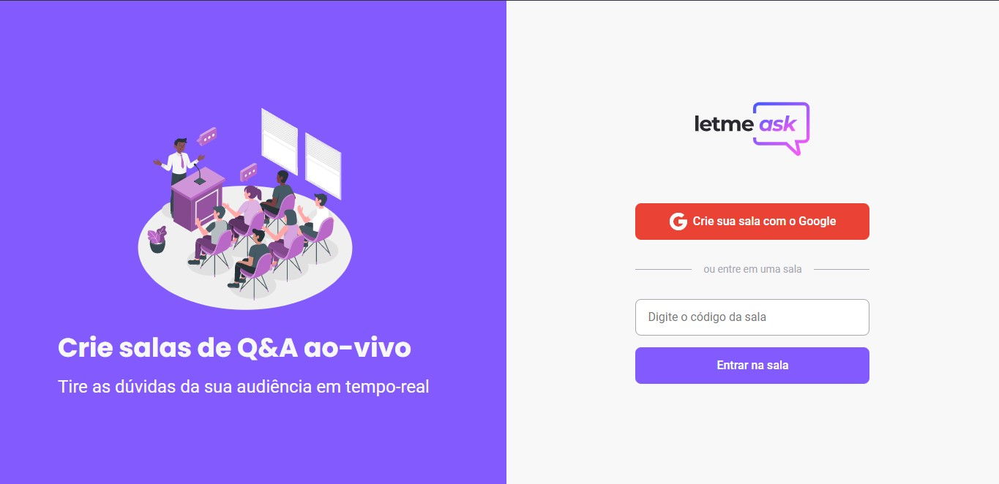

# Letmeask

  

> Projeto construido durante a [Semana NLW](https://nextlevelweek.com/pre-nlw)

## [Visualizar projeto](https://letmeask-bfee4.web.app/)

## Tecnologia: 
 * React
 * TypeScript
 * Firebase

 ## Minha alteração no projeto
 * Responsividade

## Contatos
[Anderson Pinheiro](https://www.linkedin.com/in/anderson-pinheiro-9a1544176/)
